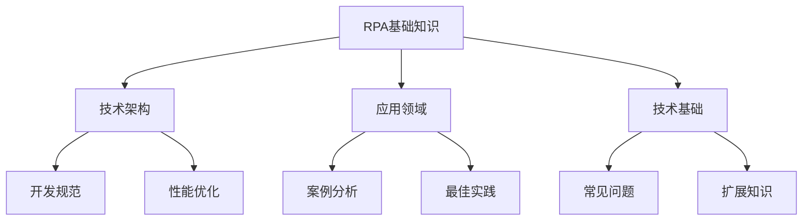

# RPA知识关联关系

## 1. 知识图谱

### 1.1 基础知识关联

## 2. 主题关联

### 2.1 技术路线关联
- **入门路线**
  - 基础知识 → 开发环境 → 核心技术 → 简单案例
  - 相关文档：
    - [RPA概述](./RPA基础知识.md#11-rpa概述)
    - [开发环境](./RPA基础知识.md#13-技术基础)
    - [UI自动化基础](./技术基础.md#ui自动化)

- **进阶路线**
  - 最佳实践 → 性能优化 → 安全规范 → 复杂案例
  - 相关文档：
    - [开发规范](./最佳实践.md#21-开发规范)
    - [性能优化](./最佳实践.md#22-性能优化)
    - [案例分析](./案例分析.md)

### 2.2 场景关联
- **财务自动化**
  - 基础技术：OCR识别、数据提取
  - 最佳实践：数据验证、异常处理
  - 案例参考：发票处理、报表生成
  - 常见问题：数据准确性、系统集成

- **人力资源**
  - 基础技术：文件处理、数据库操作
  - 最佳实践：数据安全、流程设计
  - 案例参考：招聘流程、考勤管理
  - 常见问题：数据同步、权限控制

## 3. 技术关联

### 3.1 核心技术关联
- **UI自动化**
  - 基础知识：元素定位、操作模拟
  - 最佳实践：稳定性优化、异常处理
  - 常见问题：元素识别、性能优化
  - 相关案例：系统操作自动化

- **数据处理**
  - 基础知识：数据格式、处理流程
  - 最佳实践：数据验证、错误处理
  - 常见问题：数据清洗、格式转换
  - 相关案例：报表自动化、数据分析

### 3.2 扩展技术关联
- **AI集成**
  - 基础技术：OCR、NLP
  - 应用场景：智能识别、自然语言处理
  - 最佳实践：模型选择、精度优化
  - 发展趋势：智能自动化

- **云原生RPA**
  - 基础知识：云服务、微服务
  - 技术架构：分布式部署、容器化
  - 最佳实践：资源管理、监控告警
  - 发展方向：云端协作

## 4. 问题解决关联

### 4.1 常见问题关联
- **环境配置问题**
  - 基础知识：环境要求、依赖关系
  - 解决方案：安装指南、故障排除
  - 最佳实践：环境管理、版本控制
  - 相关案例：部署实践

- **开发调试问题**
  - 基础知识：调试工具、日志系统
  - 解决方案：问题定位、错误处理
  - 最佳实践：日志规范、测试策略
  - 相关案例：问题排查

### 4.2 优化建议关联
- **性能优化**
  - 基础知识：性能指标、优化原则
  - 技术方案：代码优化、资源管理
  - 最佳实践：性能测试、监控分析
  - 案例参考：大规模自动化

- **稳定性提升**
  - 基础知识：稳定性因素、风险点
  - 技术方案：异常处理、重试机制
  - 最佳实践：监控告警、自动恢复
  - 案例参考：7*24小时运行

## 5. 学习路径关联

### 5.1 角色学习路径
- **开发人员**
  1. 基础知识 → 开发环境
  2. 核心技术 → 编码规范
  3. 最佳实践 → 性能优化
  4. 案例分析 → 实践总结

- **运维人员**
  1. 基础知识 → 系统架构
  2. 部署维护 → 监控管理
  3. 问题处理 → 优化建议
  4. 安全规范 → 运维实践

### 5.2 场景学习路径
- **业务自动化**
  1. 需求分析 → 场景识别
  2. 技术选型 → 方案设计
  3. 开发实现 → 测试优化
  4. 部署运维 → 效果评估

- **系统集成**
  1. 系统分析 → 接口设计
  2. 数据流转 → 集成测试
  3. 性能优化 → 监控告警
  4. 运维管理 → 持续改进

## 6. 更新迭代关联

### 6.1 版本更新关联
- **技术更新**
  - 基础知识更新
  - 最佳实践优化
  - 案例持续补充
  - 问题解决方案

- **文档更新**
  - 内容补充完善
  - 结构优化调整
  - 关联关系更新
  - 用户反馈处理

### 6.2 反馈优化关联
- **用户反馈**
  - 问题收集分类
  - 解决方案更新
  - 内容持续优化
  - 体验持续改进

- **实践总结**
  - 经验教训提炼
  - 最佳实践更新
  - 案例持续积累
  - 知识体系完善 