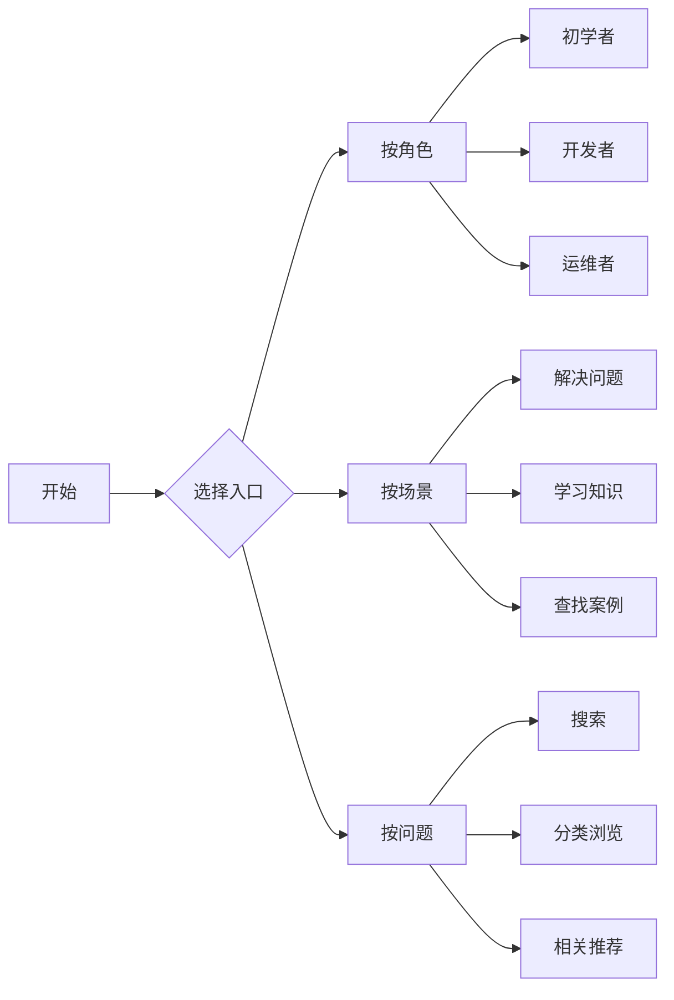

# RPA知识查询指南

## 1. 快速入口指引

### 1.1 按用户角色选择
- **初学者入口**
  1. 从[RPA基础知识](./RPA基础知识.md)开始
  2. 了解RPA定义、原理和基本概念
  3. 按[入门路线](./知识关联关系.md#21-技术路线关联)循序渐进

- **开发者入口**
  1. 直接访问[开发规范](./最佳实践.md#21-开发规范)
  2. 查看[技术关联](./知识关联关系.md#3-技术关联)了解技术体系
  3. 参考[案例分析](./案例分析.md)进行实践

- **运维人员入口**
  1. 关注[运维问题](./常见问题解答.md#运维问题)
  2. 学习[监控管理](./最佳实践.md#监控管理)
  3. 掌握[问题处理](./常见问题解答.md#问题处理)

### 1.2 按需求场景选择
- **解决问题**
  1. 直接访问[常见问题](./常见问题解答.md)
  2. 使用搜索功能定位具体问题
  3. 查看相关案例和解决方案

- **学习知识**
  1. 按[知识地图](./知识分类体系.md)系统学习
  2. 遵循[学习路径](./知识关联关系.md#5-学习路径关联)
  3. 结合案例实践加深理解

- **查找案例**
  1. 浏览[案例分析](./案例分析.md)
  2. 按行业领域筛选相关案例
  3. 参考最佳实践进行实施

## 2. 搜索方法建议

### 2.1 关键词搜索
- **技术关键词**
  - UI自动化、OCR识别、数据处理
  - 异常处理、性能优化、安全规范
  - 环境配置、问题调试、部署维护

- **场景关键词**
  - 财务自动化、人力资源、客服服务
  - 发票处理、报表生成、数据分析
  - 系统集成、流程优化、监控管理

### 2.2 组合搜索
- **技术+场景**
  - "UI自动化 + 财务系统"
  - "OCR + 发票处理"
  - "数据处理 + 报表生成"

- **问题+解决方案**
  - "元素识别 + 异常处理"
  - "性能优化 + 最佳实践"
  - "环境配置 + 故障排除"

## 3. 快速导航图

### 3.1 知识地图导航


### 3.2 常用路径
1. **快速解决问题**
   ```
   搜索关键词 → 常见问题 → 解决方案 → 相关案例
   ```

2. **系统学习知识**
   ```
   基础知识 → 技术原理 → 最佳实践 → 案例实践
   ```

3. **查找参考案例**
   ```
   行业分类 → 场景筛选 → 案例详情 → 实施参考
   ```

## 4. 使用建议

### 4.1 高效查询技巧
1. **明确目标**
   - 确定查询目的（解决问题/学习知识/找案例）
   - 选择合适的入口和路径
   - 准备相关的关键词

2. **结合场景**
   - 考虑实际应用场景
   - 参考相似案例
   - 注意实施条件

3. **系统学习**
   - 建立知识体系
   - 掌握核心概念
   - 注重实践应用

### 4.2 常见误区
1. **盲目搜索**
   - 问题：关键词不准确，范围过大
   - 建议：先明确目标，缩小范围

2. **忽视关联**
   - 问题：只看单个知识点，忽视关联内容
   - 建议：注意相关知识的连接

3. **跳过基础**
   - 问题：直接看高级内容，基础不牢
   - 建议：循序渐进，打好基础 