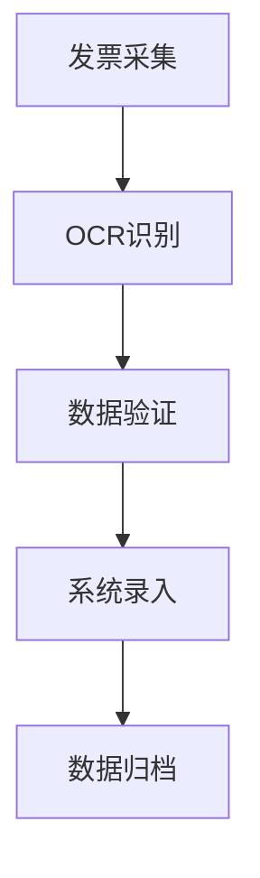

# 财务自动化案例分析

本文介绍了一个典型的财务自动化案例，详细说明了如何使用RPA技术实现发票处理自动化，提高工作效率并降低错误率。

## 项目背景

某大型企业每月需要处理超过1000张发票，包括增值税发票、普通发票等多种类型。传统人工处理方式存在以下问题：

- 处理时间长，平均每张发票需要5-10分钟
- 容易出现人为错误，错误率约2%
- 数据录入不及时，影响账务处理
- 人力成本高，需要3-4名专职人员

## 解决方案

### 技术架构


### 主要功能
1. **发票采集**
   - 支持扫描仪批量扫描
   - 支持电子发票导入
   - 自动文件分类

2. **OCR识别**
   - 智能识别发票类型
   - 提取关键字段信息
   - 自动判断发票真伪

3. **数据验证**
   - 字段格式检查
   - 金额核对
   - 重复发票检测

4. **系统录入**
   - 自动登录财务系统
   - 批量数据录入
   - 异常情况处理

5. **数据归档**
   - 电子文档存储
   - 索引建立
   - 查询接口

## 实现细节

### 发票识别流程
```python
def process_invoice(image_path):
    # 加载发票图像
    image = load_image(image_path)
    
    # OCR识别
    text = ocr_engine.recognize(image)
    
    # 提取字段
    fields = extract_fields(text)
    
    # 验证数据
    if validate_fields(fields):
        return fields
    else:
        raise ValidationError("发票数据验证失败")
```

### 系统集成
```python
def integrate_with_finance_system():
    try:
        # 登录系统
        login_to_system()
        
        # 批量录入数据
        for invoice in invoice_queue:
            enter_invoice_data(invoice)
            
        # 提交事务
        commit_transaction()
        
    except Exception as e:
        # 错误处理
        handle_error(e)
```

## 项目成效

### 效率提升
| 指标 | 优化前 | 优化后 | 提升比例 |
|------|--------|--------|----------|
| 处理时间 | 5-10分钟/张 | 30秒/张 | 90% |
| 错误率 | 2% | 0.1% | 95% |
| 人力投入 | 4人 | 1人 | 75% |

### 成本节省
- 人力成本：每年节省约30万
- 时间成本：处理周期从3天缩短到1天
- 错误成本：差错率降低95%

## 实施过程

### 第一阶段：需求分析
1. 调研现有流程
2. 识别痛点问题
3. 确定优化目标

### 第二阶段：方案设计
1. 技术选型
2. 流程设计
3. 接口定义

### 第三阶段：开发测试
1. 核心功能开发
2. 单元测试
3. 集成测试

### 第四阶段：部署上线
1. 环境部署
2. 数据迁移
3. 人员培训

## 经验总结

### 成功因素
1. **完善的前期调研**
   - 深入了解业务流程
   - 准确把握用户需求
   - 合理评估项目风险

2. **合适的技术选型**
   - OCR技术成熟度高
   - RPA框架稳定可靠
   - 系统集成接口完善

3. **严格的质量控制**
   - 多重数据验证
   - 完善的异常处理
   - 详细的操作日志

### 注意事项
> 1. 发票格式多样，需要充分测试
> 2. 系统接口可能变动，需要及时更新
> 3. 数据安全很重要，需要严格把控
> 4. 要留有人工介入的接口

## 后续优化

### 短期计划
- 提高识别准确率
- 优化处理性能
- 增加更多发票类型支持

### 长期规划
- 引入机器学习算法
- 扩展到更多业务场景
- 建立完整的发票管理平台

## 技术栈

### 核心组件
- UiPath Studio
- Tesseract OCR
- Python数据处理
- SQL Server数据库

### 开发工具
- Visual Studio Code
- Git版本控制
- Jenkins自动化部署

### 监控工具
- Grafana
- ELK日志分析
- Prometheus性能监控

## 常见问题解答

> Q: 如何处理特殊格式的发票？
> A: 系统支持自定义模板，可以针对特殊发票格式进行训练和适配。

> Q: 系统故障时如何处理？
> A: 设置了完善的故障转移机制，可以快速切换到人工处理模式。

> Q: 数据安全如何保证？
> A: 采用加密传输、访问控制、审计日志等多重安全措施。

## 未来展望

1. **技术升级**
   - 引入AI技术
   - 优化识别算法
   - 提升自动化程度

2. **功能扩展**
   - 支持更多单据类型
   - 增加数据分析功能
   - 提供移动端支持

3. **生态建设**
   - 开放API接口
   - 建设开发者社区
   - 提供解决方案市场

---

**相关文档**
- [RPA开发规范](../best-practices/development-standards.md)
- [OCR最佳实践](../best-practices/ocr-guidelines.md)
- [系统集成指南](../best-practices/integration-guide.md) 