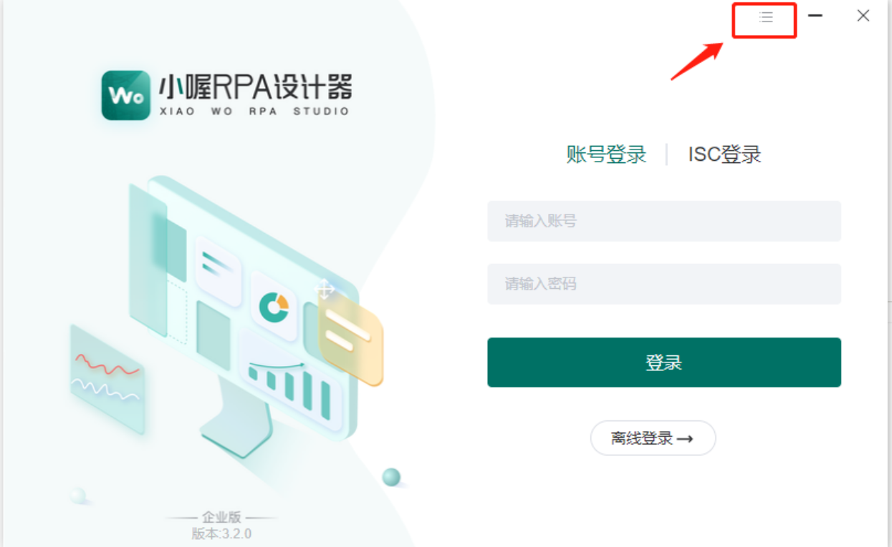
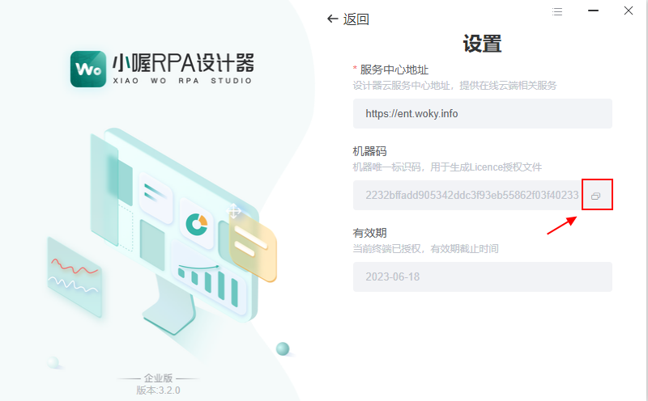
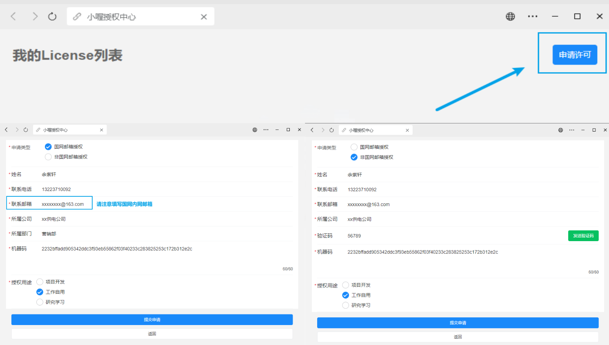
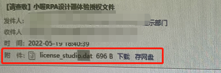
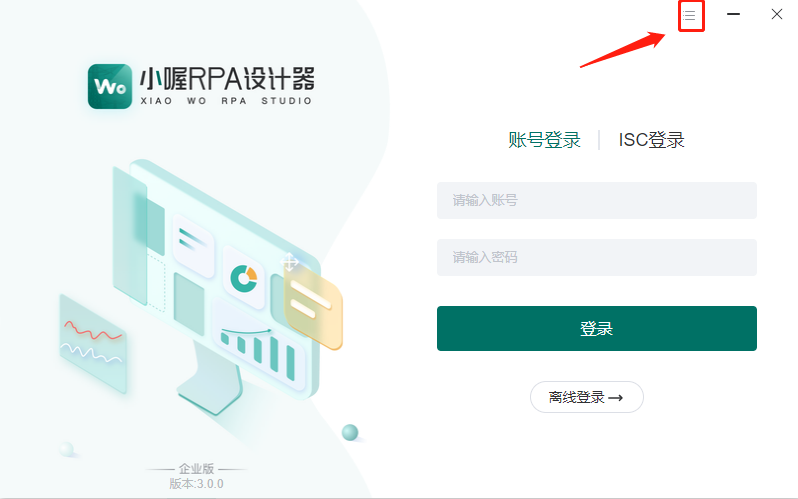
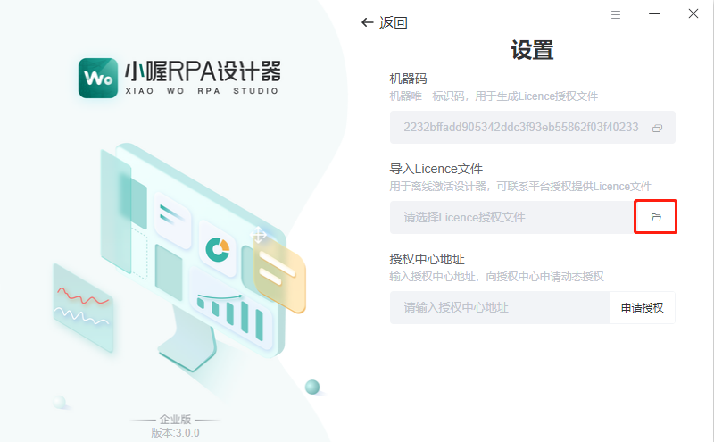
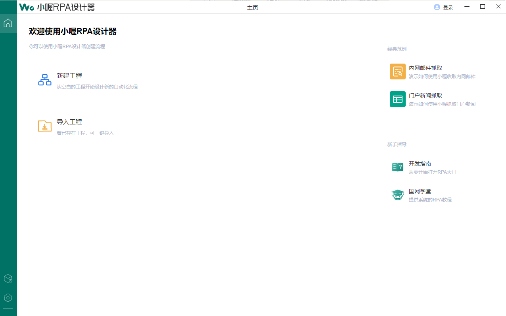

# 🎉 学习资源!

<!-- 本站源码以及全部内容： [https://github.com/bytesfly/blog](https://github.com/bytesfly/blog) -->


>` RPA`（Robotic Process Automation）是一种使用`软件机器人`来`自动化`重复性业务流程的技术。它能够`模拟`人类操作计算机的行为，执行如`数据输入`、`应用程序操作`、`文件处理`等任务。通过 RPA，企业可以提高工作效率、减少人为错误，并让员工将精力集中在更有价值的工作上。本站`收集整理`了 RPA 相关的`学习资源`，帮助你快速入门并`掌握 RPA 开发技能`。

### 📚 RPA设计器下载以及授权指南

##### 🧸 下载方式

<style>
table {
    width: 100%;
    border-collapse: collapse;
}
th, td {
    border: 1px solid #ddd;
    padding: 8px;
    text-align: center;
}
th {
    background-color: #03A9F4;
    color: white;
}
tr:nth-child(even) {
    background-color: #03A9F4;
}
tr:hover {
    background-color: #ddd !important;
}
</style>

| 下载方式 | 链接 | 说明 |
|---------|------|------|
| 外网下载 | [点击这里下载最新版本](https://pan.baidu.com/s/1SMvhW8Cr9ZFscNj8YPXjXg?pwd=ZBXC) | 📥 直接下载安装包 |
| 内网下载 | [联系](#💌-联系) | ⛓️‍💥 请联系区域RPA专责 |

**RPA设计器是自动化流程开发的核心工具**。它提供了直观的可视化界面，让用户能够`轻松地设计`、`开发和部署自动化`流程。通过"**录制+编辑+调试+发布**"的开发流程，即使是编程经验有限的用户也能快速掌握RPA流程的开发。

为了方便大家获取和使用RPA设计器，我们提供了`多种下载渠道`。外网用户可以直接通过`百度网盘链接下载最新版本`，内网用户则需要联系区域`RPA专责`获取。请注意，使用RPA设计器需要`有效的授权许可`。如果您在下载或使用过程中遇到任何问题，欢迎通过`下方的联系方式`与我们沟通。**我们致力于为每位用户提供便捷的自动化开发体验**，让RPA技术真正服务于业务效率的提升。

##### 🐼 授权获取

>(1)复制机器码💡

**安装完成后，打开小喔RPA设计器，点击右上角按钮，进入授权界面，复制机器码。**
<div class="card-container">
    <div class="card">
        
    </div>
    <div class="card">
        
    </div>
</div>

<style>
.card-container {
    display: flex;
    flex-wrap: wrap;
    gap: 20px;
    justify-content: flex-start;
    margin: 20px 0;
}

.card {
    width: 320px;
    height: auto;
    border-radius: 12px;
    box-shadow: 0 4px 8px rgba(0,0,0,0.1);
    overflow: hidden;
    transition: transform 0.3s ease;
}

.card:hover {
    transform: translateY(-5px);
    box-shadow: 0 6px 12px rgba(0,0,0,0.15);
}

.card-image {
    width: 100%;
    height: auto;
    object-fit: contain;
}
</style>

>(2)获取授权💪🏼
- a、扫码关注`小喔官方公众号`-`小喔RPA服务`，在底部菜单栏点击【`关于小喔`】-【`申请授权`】；
<div class="card-container">
    <div class="card" style="height: auto;">
        
    </div>
</div>

<style>
.card {
    width: 320px;
    height: auto;
    border-radius: 12px;
    box-shadow: 0 4px 8px rgba(0,0,0,0.1);
    overflow: hidden;
    transition: transform 0.3s ease;
}

.card-image {
    width: 100%;
    height: auto;
    object-fit: contain;
}
</style>

- b、点击【**申请许可**】，进入到信息填写界面。

| 授权方式 | 说明 |
|---------|------|
| 国网邮箱授权 |  授权文件将直接发送至填写的国网内网邮箱中<br> 请注意正确填写国网内网邮箱地址！ |
| 非国网邮箱授权 |  授权文件将直接发送至填写的外网邮箱中 |

📝 完成信息填写后，点击【**提交申请**】按钮即可。
<div class="card-container">
    <div class="card" style="height: auto;">
        
    </div>
</div>

- c、提交申请表大概`10分钟`后，登录填写的邮箱，找到主题为“`【请查收】小喔RPA设计器体验授权文件`”的邮件，附件即为`Licence`文件。

<div class="card-container">
    <div class="card" style="height: auto;">
        
    </div>
</div>

- d、下载授权文件后，打开小喔RPA设计器，点击右上角设置按钮

<div class="card-container">
    <div class="card" style="height: auto;">
        
    </div>
</div>

- e、找到导入licence文件选项，点击右侧文件夹按钮，选择刚刚下载的的licence文件即可

<div class="card-container">
    <div class="card" style="height: auto;">
        
    </div>
</div>

- f、进入设计器首页，即代表授权成功

<div class="card-container">
    <div class="card" style="height: auto;">
        
    </div>
</div>

>(3)[**点击这里**-人工方式获取授权👩🏼‍🦰](#💌-联系)

##### 🐦‍🔥快速开始

❗创建并运行第一个小喔RPA流程

------  
<div class="tech-card">
    <div class="tech-content">
        在数字化办公与自动化流程日益普及的当下，小喔 RPA（机器人流程自动化）以其强大的功能和便捷的操作，为众多企业和个人带来了高效的工作体验。当您成功获取小喔设计器的授权之后，便正式开启了探索自动化流程的大门，即刻可以尝试创建并运行独属于您的 RPA 流程。这不仅是迈向高效办公的重要一步，更能为您节省大量的时间与精力，优化工作流程。请您紧跟以下详细操作步骤，逐步创建您的第一个 RPA 流程，亲身体验小喔 RPA 带来的自动化变革。
    </div>
</div>

<style>
.tech-card {
    background: #03A9F4;  /* 设置为指定的蓝色 */
    padding: 25px;
    margin: 20px 0;
    box-shadow: 0 8px 32px rgba(31, 38, 135, 0.15);
    position: relative;
    overflow: hidden;
}

.tech-card::before {
    content: '';
    position: absolute;
    top: -50%;
    left: -50%;
    width: 200%;
    height: 200%;
    background: linear-gradient(
        45deg,
        transparent,
        rgba(255, 255, 255, 0.2),
        transparent
    );
    transform: rotate(45deg);
    animation: shine 3s infinite;
}

.tech-content {
    color: #ffffff;  /* 改为白色文字以提高可读性 */
    line-height: 1.6;
    text-align: justify;
    position: relative;
    z-index: 1;
    font-weight: bold;
}

@keyframes shine {
    0% {
        transform: translateX(-100%) rotate(45deg);
    }
    100% {
        transform: translateX(100%) rotate(45deg);
    }
}
</style>


>  （一）创建RPA流程工程

首先需要在首页点击【**新建工程**】按钮，选择【**流程工程**】并填写工程名称及存储路径，填写完成后，点击【**确定**】按钮即完成了新建工程。

>  （二）在工程文件夹内创建txt文件

a、创建流程完成后，在工程流程图界面，点击流程块上的【**编辑**】按钮，进入动作编辑界面。

b、点击左侧的动作栏目【**基础动作**】-【**文件操作**】-【**通用文件操作**】，选择【**创建文件**】动作，选中并拖入到画布中；

c、双击该动作，进入动作配置界面，在【**创建路径**】框内，输入想要创建的txt的名称及位置。

**格式为：路径（黄色部分）+文件名（蓝色部分）**

此处演示为创建在工程文件夹内，名称为test，请按自己电脑实际路径进行修改！

📢（注意路径需要用半角双引号括起来以及路径中需使用双斜杠）

```text
"C:\\Users\\newes\\Desktop\\小喔工程\\first\\test.txt"
```

>  （三）在txt文件写入内容

a、点击左侧的动作栏目【**基础动作**】-【**文件操作**】-【**文本文件处理**】，选择【**覆盖写入文本**】动作，选中并拖入到画布中；

b、双击该动作，进入动作配置界面，在【**写入内容**】框内输入

```text
 "hello xiaowo"
```

【**文件路径**】框内输入

```text
"C:\\Users\\newes\\Desktop\\小喔工程\\first\\test.txt"
```

📢（注意文本及路径需要用半角双引号括起来）

>  （四）运行RPA流程

完成动作配置后，在工具栏中点击【**运行**】按钮，执行该流程；

调试区中出现**红圈**提示后，说明**操作成功**🔥；

查看刚刚创建的txt文件验证结果；

如果你看到了以上的执行结果，那么祝贺你，你已经成功完成了你的第一个RPA流程开发。

附：快速体验视频教程

<div class="video-container">
    <div class="video-wrapper">
        <iframe 
            src="./images/第一个工程.mp4"
            frameborder="0" 
            allow="accelerometer; autoplay; clipboard-write; encrypted-media; gyroscope; picture-in-picture" 
            allowfullscreen>
        </iframe>
    </div>
    <div class="video-overlay">
        <div class="overlay-content">
            <h3 style="color: white;">🎯 快速上手教程</h3>
            <p>观看视频，3分钟掌握RPA流程开发精髓</p>
        </div>
    </div>
</div>

<style>
.video-container {
    position: relative;
    background: linear-gradient(45deg, #0a2463, #1e88e5);
    border-radius: 12px;
    padding: 20px;
    margin: 30px 0;
    box-shadow: 0 8px 32px rgba(31, 38, 135, 0.15);
    backdrop-filter: blur(4px);
    border: 1px solid rgba(255, 255, 255, 0.18);
}

.video-wrapper {
    position: relative;
    width: 100%;
    padding-bottom: 56.25%; /* 16:9 比例 */
}

.video-wrapper iframe {
    position: absolute;
    top: 0;
    left: 0;
    width: 100%;
    height: 100%;
    border-radius: 8px;
}

.video-overlay {
    position: absolute;
    top: 0;
    left: 0;
    right: 0;
    background: linear-gradient(135deg, rgba(0,0,0,0.8) 0%, transparent 100%);
    padding: 20px;
    border-radius: 12px 12px 0 0;
}

.overlay-content {
    color: white;
}

.overlay-content h3 {
    margin: 0;
    font-size: 1.5em;
    text-shadow: 2px 2px 4px rgba(0,0,0,0.5);
}

.overlay-content p {
    margin: 10px 0 0;
    font-size: 1em;
    opacity: 0.9;
}

@media (max-width: 768px) {
    .video-container {
        margin: 15px 0;
        padding: 10px;
    }
    
    .overlay-content h3 {
        font-size: 1.2em;
    }
    
    .overlay-content p {
        font-size: 0.9em;
    }
}
</style>

##### 💌 联系

- Email： 13191142883@163.com

- 移动电话：1️⃣3️⃣1️⃣9️⃣1️⃣1️⃣4️⃣2️⃣8️⃣8️⃣3️⃣

- 公司官网： [https://www.sxzbxc.com/index.html](https://www.sxzbxc.com/index.html)

- 微信公众号： **RPA电力支援小站**（扫码关注我呀）

  <div ></div>
