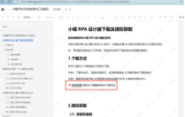

<!-- 前期准备 -->
# 运行环境：

处理器 2.8GHZ 4 核心 4 线程 及以上

内存 8GB 及以上

硬盘 100G 及以上

网卡 1000兆以太网卡

# 小喔RPA软件运行最低配置：

    操作系统：windows7 sp1 64 位（优先）或 window10 64 位

    Office/WPS 版本：WPS 国网专版，Mircrosoft office 2010 及以上

    浏览器 谷歌浏览器（Chrome）60 及以上版本

# 软件下载

下载地址：https://docs.qq.com/doc/DV1ZQb09PdGV5SU1j

# 小喔RPA申请授权

关注小喔RPA公众号，点击关于小喔进入申请授权，按照要求填报许可申请，等待Licence文件下发后导入小喔RPA即可

# 小喔RPA登录

如已完成授权，则不需要登录，如无授权，点击ISC登录，输入国网门户账号即可登录使用。

# 小喔RPA插件下载

进入小喔RPA点击左下角设置按钮，选择驱动设置，进入后选择谷歌浏览下下安装按钮，安装完成后弹框提示。

# 浏览器插件激活

    插件安装完成后打开谷歌浏览器，右上角弹窗询问启用扩展，如未弹窗，则点击右上角进入设置，进入扩展程序管理界面，手动将xiaowo开头扩展程序打开。开启后即可关闭浏览器。