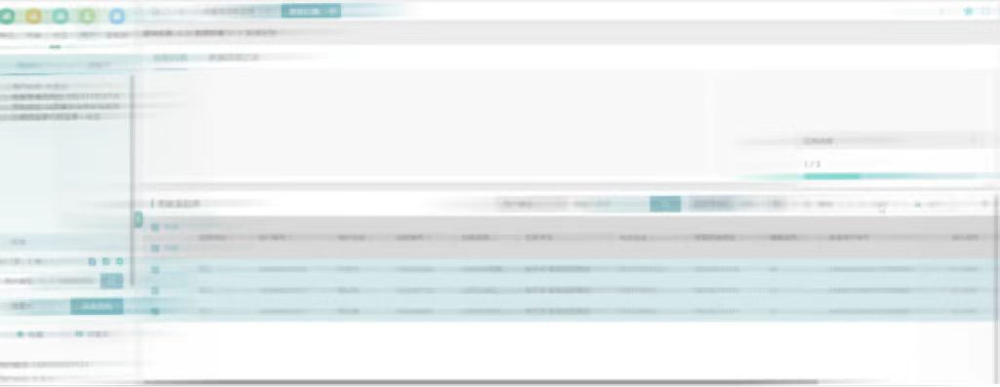
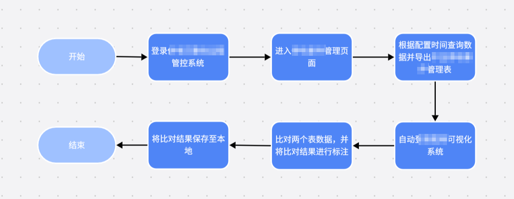

# 🚀营销

------

### &emsp;👉费控复电

> 背景介绍

&emsp;&emsp;😁传统的**费控复电业务**为在欠费停电用户在通过多渠道进行缴费后，会在**营销2.0系统**中先自动执行复电命令下发，每个单位分别需要**1名复电值班员**值守，定时手动筛选在途工单、不停刷新**实时监测**，或通过三级服务调度派单的方式，优先对需要复电的用户进行系统远程复电并手动归档工单，部分系统无法复电的需要进行**现场复电工作**。

&emsp;&emsp;😫目前存在的问题：

> ①**环节多**，流程复杂，容易发生故障对用户电表停复电状态感知错误；
>
> ②系统显示和现场显示停电状态不一致，显示**“假复电”**；
>
> ③人工手动执行，**效率低下**，非工作时间复电失败**无法及时响应**；

&emsp;&emsp;机器人将**24**h根据设定的时间**自动执行**，**实时监测**复电复核工单并二次复电，系统归档，整个流程如果出现异常工单会**自动短信提醒**指定负责人。复电后将进一步透抄用户电表，将电表的系统状态和现场状态进行匹配，不一致进行短信提醒用户确认。

> 具体步骤

🔅***\*1.获取代办工单\****

①RPA机器人在设定时间自动登录营销系统

②自动打开代办工单菜单筛选复电复核工单

🔅***\*2.费控复电，复电成功记录结果并进行归档操作\****

①**RPA机器人**逐个工单进行二次复电

②复电成功后归档营销系统的基线加复电工单

🔅***\*3.系统复电失败短信提醒\****

①**复电多次失败**切换账号打开自定义发送短信菜单

②将现场需复电用户的详细信息**发送至复电工作人员**

🔅***\*4.系统电流检测异常短信提醒\****

①对复电工单进行电流**数据透抄**

②**判断电流数值**，不为零证明复电成功

③电流为零，则无法准确判断现场表计**是否合闸成功**

④短信发送至用户以及工作人员**进行现场确认**

> 实现效果

| ⚡7\*24h实时监控复电                               | ☀️短信提醒，及时响应：                              | 💫规避“假复电”                                    |
| ------------------------------------------------------------ | ------------------------------------------------------------ | ------------------------------------------------------------ |
| 在有自动机器人的支撑下，每个单位**无需安排人员**进行实时监控，掌握复电工单处理情况，便可轻松解决欠费复电申请工单**处理量大、时间长、效率低**等突出问题。由于是全天候自动接单、精准传递及自动回单，该自动化工具能够将欠费复电工单处理时长由原来的最多✈️三个小时分钟压减至**45分钟以内**，同时处理平均时长也大幅压缩,从原来的**1.5小时**以上下降至目前的**30分钟内**,🚀成功处置率平均达**95%**以上。 | 因**多系统命令下发**与**指令回传**，**环节多，流程复杂**、表计现场环境较为复杂、计量设备品规不同、系统终端信道稳定性等不可控因素，智能复电自动化处置小工具在实际应用中无法100%实现准确复电，可能会出现用户现场复电情况与系统不符的情况。所以需要给对应的台区负责人自动发送短信，通知其进行人工处理。基层员工可根据复电服务要求，设置复电工单监控的频率间隔，可从**每2分钟一次至每1小时一次**。 | 为避免自动化处置小工具出现误判，在远程复电成功后，还会通过用采系统，**分析终端里用户**的实时电流值，若透抄电流成功，则复电工单归档，若透抄电流失败或者为0，将延迟5分钟再透超一次，2次透抄均失败或为0则**发短信通知负责人**，进行现场处理。 |

> 场景使用注意事项

​	硬件环境需要满足**64位**的**Window7**及以上的操作系统配置。在机器人运行的阶段中**请勿操作电脑**，以免机器人中断，若不小心中断机器人操作，请按组合键**Ctrl+Shift+Q**结束本次运行，等待机器人的下一次执行。

***

<!-- 数据补招 -->

### &emsp;👉数据补招

> 背景介绍

- **供电所人员**每天需要通过**采集2.0系统**对采集失败用户进行数据补招，但由于采集失败**用户量大**且为保证**补招成功率**需要逐户进行操作，
- 工作人员每天需要**耗费2-3小时**进行补招操作，如遇到极端天气情况**采集失败用户数急剧增多**，人工采集时长更高，针对此项**重复操作且耗时的业务流程**迫切需要通过自动化流程机器人代替人工执行。

> 具体步骤

&emsp;&emsp;😋我们主要做法是通过**RPA自动化流程机器人**，实现自动导出数据补招失败用户，并对失败用户实现自动补招业务操作。

😎**业务流程即：**

- 自动登录采集2.0系统
- 在采集成功率检测中导出区县单位采集失败明细
- 通过Excel表格操作，筛选出以供电所为单位或以营业厅为单位的失败表计及用户
  在数据召测中自动对失败表计或终端进行数据补招，为保证补招成功率采取自动多次补招策略，最后把无法召测回的数据写入Excel表格，发送至后台管理人员进行处理

  

> 实现效果

🎆**任务频率：每天执行**

🎇**应用成效：**

> 设定非工作时间**定时自动执行**，工作时间**不占用电脑**，**释放员工工作时间**，提升工作效率；
>
> **一键执行**，自动导出采集失败用户并根据失败数据自动进行补招操作，无需人工干预；
>
> 采取多次重复**自动补招策略**，提升补招成功率，提升部门考核指标。

图1 自动查询失败用户

图2 对失败用户进行自动补招

> 场景使用注意事项

&emsp;&emsp;硬件环境需要满足**64位**的**Window7**及以上的操作系统配置。在机器人自动运行的阶段中**请勿操作电脑**，以免机器人中断，若不小心中断机器人操作，请按组合键**Ctrl+Shift+Q**结束本次运行，等待机器人的下一次执行。

------

<!-- 资产管理 -->

### &emsp;👉资产管理

> 背景介绍

- 供电公司人员每天需要通过**营销2.0系统**按**单位层级、资产类型、资产状态、库房类型**等多维度统计资产在库情况，完成对**全部资产**的精准分析，帮助资产有序流转与相互调配。
- 工作人员每天需要耗费**4-5小时**进行资产统计的操作，针对此项重复操作且耗时的业务流程迫切需要通过**自动化流程机器人**代替人工执行。

> 具体步骤

&emsp;&emsp;😋我们主要做法是通过**RPA自动化流程机器人**，实现**自动登录营销2.0**-->**资产统计**-->**选择单位**-->**选择资产类型**-->**选择资产状态**-->**选择库房类型**-->**点击查询**-->**复制下发总条数数字**，对所有按照单位层级、资产类型、资产状态、库房类型等多维度统计资产在库情况数据填写至**Excel表格**，并对统计数据进行计算总和，占比分析，最后把此统计完成的表格**发送至专工邮箱**。

> 业务流程即：

- 自动登录营销2.0系统

- 对资产统计进行查询条件筛选

- 选择库房类型以及其他配置条件

- 最后生成Excel表格进行数据分析

> 实现效果

🎆**任务频率：每天执行**

🎇**应用成效：**

> 设定非工作时间**定时自动执行**，工作时间**不占用电脑**，**释放员工工作时间**，提升工作效率；
>
> **一键执行**，**自动导出**各种不同电流，电压合格在库，配送在途，运行的电能表，互感器，专变信息，自动发送，**自动审核**；
>
> 提高了**机器利用率**，提升部门考核指标。

    

        
    

    

        
    

图1、图2  现场使用情况

> 场景使用注意事项

&emsp;&emsp;硬件环境需要满足**64位**的**Window7**及以上的操作系统配置。在机器人自动运行的阶段中**请勿操作电脑**，以免机器人中断，若不小心中断机器人操作，请按组合键**Ctrl+Shift+Q**结束本次运行，等待机器人的下一次执行。

------

# ☎️供服

------

<!-- 早九晚五工单预警 -->

### &emsp;👉早九晚五工单预警

> 背景介绍

- 随着业务量的增长，**国网95598系统**中积累了大量未处理和审核的数据，这些数据若不及时处理，将直接影响客户体验与业务运营效率。
- 为了确保数据的及时处理与业务的**高效运转**，开发**RPA自动化汇总与提醒场景**，并自动发送给业务部门，作为处理与审核的提醒，从而有效推动业务进程，提升运营效率。

> 具体步骤

&emsp;&emsp;😋在当下数字化办公持续革新的大背景下，我们致力于通过引入先进的技术手段，显著提升工作效率与数据处理的精准度。我们的核心工作策略聚焦于运用 **RPA（机器人流程自动化）技术**，实现对**国家电网 95598 系统**的高效自动化操作。

- 首先，借助精心编制的 RPA 流程脚本，系统能够**模拟人工操作流程**，自动完成在 95598 系统中的登录步骤。这一过程不仅摒弃了繁琐的手动输入用户名和密码等常规操作，还极大地降低了因人为因素导致的登录错误风险。登录成功后，RPA 机器人依据预设的业务逻辑，精准定位到系统内各类相关的业务类型板块。在这些板块中，它运用强大的数据检索功能，**快速且准确地筛选出符合特定要求的数据信息。**
- 接下来，对于已检索出的数据，我们深入开展**数据采集工作**。RPA 技术能够智能识别并采集那些对后续分析至关重要的数据字段，确保数据的完整性与准确性。采集完成后，利用先进的 RPA 数据智能算法对这些数据进行深度分析。此算法基于复杂的数学模型和**机器学习技术**，能够从海量的数据中挖掘出有价值的信息和潜在规律。
- 最后，为了更直观地呈现分析结果，方便工作人员快速理解和做出决策，我们**采用颜色标注**的方式。根据算法分析得出的不同数据特征、风险等级或重要程度等因素，**为相应的数据赋予不同的颜色标识。**例如，将高风险数据标注为红色，低风险数据标注为绿色，中等风险数据标注为黄色。通过这种可视化的方式，使原本复杂的数据变得一目了然，极大地提高了数据的可读性和处理效率。

😎**业务流程即：**

> 实现效果

🎆**任务频率：每天执行**

🎇**应用成效：**

- **提升了客户满意度**：及时的预警信息和快速的数据处理速度，提升了客户满意度；
- **提高了运营效率**：数据的及时处理与业务的高效运作，提高了整体运营效率，为企业创造了更多的价值；
- **减少了客户投诉**：数据的及时处理减少了客户投诉和纠纷，降低了企业的运营成本。

> 场景使用注意事项

&emsp;&emsp;硬件环境需要满足**64位**的**Window7**及以上的操作系统配置。在机器人自动运行的阶段中**请勿操作电脑**，以免机器人中断，若不小心中断机器人操作，请按组合键**Ctrl+Shift+Q**结束本次运行，等待机器人的下一次执行。

------

<!-- **配网停运周报自动生成** -->

### &emsp;👉配网停运周报自动生成

> 背景介绍

- 在电力运维管理中，为了及时掌握电网运行状态，确保**供电稳定性和可靠性**，每周需**编制线路停运周报、配变停运周报以及用户停运周报**。这些周报的编制流程涉多个系统，操作繁琐。
- 首先，工作人员需从系统中**导出线路、配变及用户停运的年数据与周数据**，这些数据反映了电网在不同时间尺度下的停运情况。
- 随后，对年数据进行**必要的列排序，并筛选出特定区域的数据**，同时对周数据也执行相同的筛选操作。
- 最后，将筛选后的年数据和周数据分别**复制到对应的周报工作表**中，形成包含详细停运信息的周报文档。这一过程对于分析电网停运原因、优化运维策略及提升供电服务质量具有重要意义。

>  具体步骤

&emsp;&emsp;😋我们借助 RPA 技术，首先自动登录**配网可视化** 系统，接着导出**停运年数据与周数据**，然后对这些数据进行筛选，**筛选后再按照特定规则进行排序**，之后从排序后的数据中提取出所需结果，最后将结果保存至周工作表内，至此整个流程结束。此流程通过自动化操作，提高了数据处理效率与准确性，减少了人工操作的繁琐与错误风险，适用于需定期处理大量数据的场景，助力企业更好地利用数据提升运营管理水平与决策质量。

😎**业务流程即：**

> 实现效果

🎆**任务频率：每天执行**

🎇**应用成效：**

- **提升工作效率**：RPA技术能够自动执行登录配网可视化系统、导出线路、配变及用户停运数据等重复性工作，显著提高了数据收集和处理的效率。
- **数据筛选的准确性**：RPA能够准确地对年数据进行列排序，并筛选出特定区域的数据，确保周报中数据的准确性和完整性。同时自动化筛选过程减少了人为错误的可能性，提高了数据处理的准确性和可靠性。
- **周报生成的标准化**：RPA能够将筛选后的数据自动复制到周报工作表中，形成最终结果，实现了周报生成的自动化和标准化；自动化生成的周报格式统一、内容准确，提高了报告的可读性和可用性。

> 场景使用注意事项

&emsp;&emsp;硬件环境需要满足**64位**的**Window7**及以上的操作系统配置。在机器人运行的阶段中**请勿操作电脑**，以免机器人中断，若不小心中断机器人操作，请按组合键**Ctrl+Shift+Q**结束本次运行，等待机器人的下一次执行。

------

# 🎁物资

------

<!-- ***自动化单据签章*** -->

### &emsp;👉自动化单据签章

> 背景介绍

- 物资部门在处理货物交接单的相关流程时，工作人员通常需要**手动登录电子签署辅助作业工具平台**，并**下载所需资料**，这一步骤不仅效率低下，而且极大地消耗了人力资源。
- 相比之下，对于登录ERP系统进行评价管理和发票管理的任务，则更适合采用**自动化手段**，例如通过部署机器人来执行，这样可以显著减轻工作人员的负担，提升整体作业效率。

> 具体步骤

&emsp;&emsp;😋我们借助 RPA 技术，首先自动登录**电力调度自动化**系统，接着导出**负荷数据与峰谷数据**，然后对这些**数据进行清洗**，清洗后再依据预设标准进行**分类**，之后从分类后的数据中**提炼**出关键信息，最后将信息**保存至月度分析表**内，至此整个流程结束。

&emsp;&emsp;💎此流程通过**自动化操作**，显著提升了**数据处理的速度与精准度**，降低了人工干预带来的繁杂与失误隐患，适用于需频繁处理海量数据的情境，有力地推动企业更高效地运用数据增强运营管控水准与战略决策效能。

😎**业务流程即：**

> 实现效果

🎆**任务频率：每天执行**

🎇**应用成效：**

- **流程自动化与效率提升**：RPA技术能够自动化处理诸如登录电子签署辅助作业工具平台、下载货物交接单所需资料、登录ERP系统进行评价管理和发票管理等重复且繁琐的业务流程。通过自动化这些流程，企业能够显著减少人工操作的时间，提升工作效率，从而更快地响应客户需求，缩短业务处理周期。
- **减少错误与提高准确性**：人工操作往往容易出错，尤其是在处理大量数据时。RPA技术通过精确模拟人工操作，能够减少因人为因素导致的错误，提高业务处理的准确性。例如，在下载货物交接单所需资料时，RPA可以确保所有必需的文件都被正确下载，避免了遗漏或错误下载的情况。
- **资源优化与成本节约**：RPA的应用能够释放人力资源，使工作人员从重复性的工作中解脱出来，专注于更具价值的任务。这不仅提升了员工满意度和工作效率，还降低了企业的人力成本。同时，RPA还能够优化业务流程，减少不必要的环节，进一步降低成本。

> 场景使用注意事项

&emsp;&emsp;硬件环境需要满足**64位**的**Window7**及以上的操作系统配置。在机器人自动执行的阶段中**请勿操作电脑**，以免机器人中断，若不小心中断机器人操作，请按组合键**Ctrl+Shift+Q**结束本次运行，等待机器人的下一次执行。

------

# 🛂运检

------

### &emsp;👉配网可视化数据自动比对

> 背景介绍

- 在现代电力系统的复杂运维环境中，**供电可靠性与服务质量的提**升成为了电力企业关注的重点。为了实现对供电过程的**精细化管理**，企业部署了**多个专业系统**来支持日常运营。其中，供电可靠性过程管控系统与配网可视化系统是两个至关重要的组成部分。
- **自动比对**整个流程不仅耗时费力，而且容易出错。由于涉及到多个系统的切换和数据的手工比对，工作人员的工作负担较重，且难以保证数据的准确性和完整性。因此，企业急需RPA自动化技术来优化这一业务流程，提升供电可靠性管理的效率和准确性。

> 具体步骤

&emsp;&emsp;😋我们借助 RPA 技术，首先自动登录**供电可靠性管控系统** ，接着进入**管理页面**，然后根据配置时间查询数据并**导出管理表**，之后自动登录 **配网可视化系统**，再比对两个表数据，并将比对结果进行标注，最后将比对结果**保存至本地**，至此整个流程结束。

😎**业务流程即：**

> 实现效果

🎆**任务频率：每天执行**

🎇**应用成效：**

- **流程自动化与效率提升**：RPA机器人能够自动登录供电可靠性过程管控系统，执行停电事件管理查询，导出中压停电事件管理表；随后自动切换至配网可视化系统，执行停电信息发布查询，导出停送电信息表。这一过程无需人工干预，极大地缩短了操作时间，提升了工作效率。
- **数据比对与准确性增强**：RPA机器人能够自动比对两份表格中的数据，精准识别出相同的数据项，并在停电信息表中高亮显示。这一过程避免了人工比对可能带来的错误和遗漏，提高了数据的准确性和可靠性。
- **资源优化与成本节约**：RPA技术的应用释放了工作人员从繁琐的数据查询、导出和比对工作中，使他们能够专注于更具价值的分析和决策工作。这不仅优化了人力资源配置，还降低了运营成本。

> 场景使用注意事项

&emsp;&emsp;硬件环境需要满足**64位**的**Window7**及以上的操作系统配置。在机器人自动执行的阶段中**请勿操作电脑**，以免机器人中断，若不小心中断机器人操作，请按组合键**Ctrl+Shift+Q**结束本次运行，等待机器人的下一次执行。

------

### &emsp;👉PMS3.0附件自动下载

> 背景介绍

- 在当前的业务环境中，工作人员需要**频繁登录pms3.0系统**以获取技改项目和大修项目的相关信息。这一流程涉及**多个层级的菜单导航和参数配置**。在PMS系统上，他们需要根据实际**需求配置统计类型和计划年度，**然后点击查询按钮以检索相关项目。对于检索到的每一个项目，工作人员都需要手动进行附件的下载操作。
- 然而，这一流程存在一个**显著的业务痛点，**对于数量庞大的项目而言，每次进行**附件下载操作**都需要人工逐个点击菜单、配置参数并执行下载，这一过程极为繁琐且耗时。这不仅极大地消耗了人力资源，还显著降低了工作效率。因此，亟需一种自动化的解决方案来优化这一流程，减轻工作人员的负担，并提高整体业务处理的效率。

> 具体步骤

&emsp;&emsp;😋我们借助**RPA流程自动化**相关技术，首先登录进入特定系统，接着依次点击进入相应**统计子菜单**，然后根据需求选择**合适的统计类型**，依据查询结果将每个项目的所有项目**附件下载到本地**，之后判断是否还有其他项目类型，若有则切换选择项目类型继续操作，若无则流程结束。

&emsp;&emsp;此流程通过**有序的操作步骤和合理的判断机制**，实现了**多项目类型的数据统计与附件下载**，提高了数据处理效率与全面性，适用于需对不同项目类型进行统一数据处理和资料收集的业务场景，助力企业或组织更好地管理和利用相关数据及资料。

😎**业务流程即：**

> 实现效果

🎆**任务频率：每天执行**

🎇**应用成效：**

- **设定非工作时间定时自动执行**，工作时间不占用电脑，释放员工工作时间，提升工作效率；
- **一键执行**，自动导出采集失败用户并根据失败数据自动进行补招操作，大大降低了人工出错率；
- **采取多次重复自动补招策略**，提升补招成功率，提升部门考核指标。

> 场景使用注意事项：

&emsp;&emsp;硬件环境需要满足**64位**的**Window7**及以上的操作系统配置。在机器人自动执行的阶段中**请勿操作电脑**，以免机器人中断，若不小心中断机器人操作，请按组合键**Ctrl+Shift+Q**结束本次运行，等待机器人的下一次执行。
