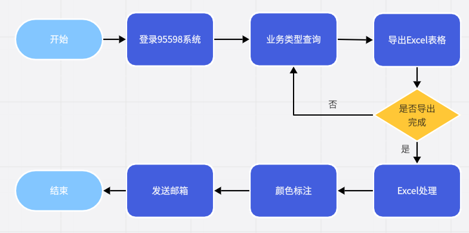

<h1 class="navbarBottom"></h1>

***

# 朝九晚五工单预警RPA场景分享

## 场景介绍：

​	随着业务量的增长，国网95598系统中积累了大量未处理和审核的数据，这些数据若不及时处理，将直接影响客户体验与业务运营效率。为了确保数据的及时处理与业务的高效运转，国网决定开发RPA自动化汇总与提醒场景，并自动发送给业务部门，作为处理与审核的提醒，从而有效推动业务进程，提升运营效率。

## 场景流程：

 

## 应用成效：

​	1.提升了客户满意度：及时的预警信息和快速的数据处理速度，提升了客户满意度；

​	2.提高了运营效率：数据的及时处理与业务的高效运作，提高了整体运营效率，为企业创造了更多的价值；

​	3.减少了客户投诉：数据的及时处理减少了客户投诉和纠纷，降低了企业的运营成本。

## 联系我们：

​	如需要RPA技术支持、详细场景介绍以及RPA项目相关，请联系我们：

