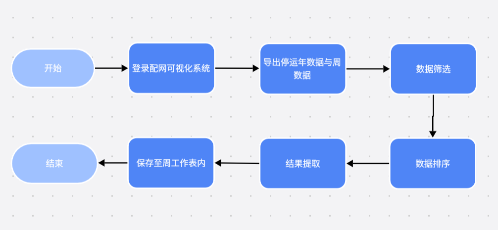

<h1 class="navbarBottom"></h1>

***

# 配网停运周报自动生成RPA场景分享

## 场景介绍：

​	在电力运维管理中，为了及时掌握电网运行状态，确保供电稳定性和可靠性，每周需编制线路停运周报、配变停运周报以及用户停运周报。这些周报的编制流程涉多个系统，操作繁琐。首先，工作人员需从系统中导出线路、配变及用户停运的年数据与周数据，这些数据反映了电网在不同时间尺度下的停运情况。随后，对年数据进行必要的列排序，并筛选出特定区域的数据，同时对周数据也执行相同的筛选操作。最后，将筛选后的年数据和周数据分别复制到对应的周报工作表中，形成包含详细停运信息的周报文档。这一过程对于分析电网停运原因、优化运维策略及提升供电服务质量具有重要意义。

## 场景流程：

 

## 应用成效：

​	1.提升工作效率：RPA技术能够自动执行登录配网可视化系统、导出线路、配变及用户停运数据等重复性工作，显著提高了数据收集和处理的效率。

​	2.数据筛选的准确性：RPA能够准确地对年数据进行列排序，并筛选出特定区域的数据，确保周报中数据的准确性和完整性。同时自动化筛选过程减少了人为错误的可能性，提高了数据处理的准确性和可靠性。

​	3.周报生成的标准化：RPA能够将筛选后的数据自动复制到周报工作表中，形成最终结果，实现了周报生成的自动化和标准化；自动化生成的周报格式统一、内容准确，提高了报告的可读性和可用性。

## 联系我们：

​	如需要RPA技术支持、详细场景介绍以及RPA项目相关，请联系我们：焦工 13191142883
