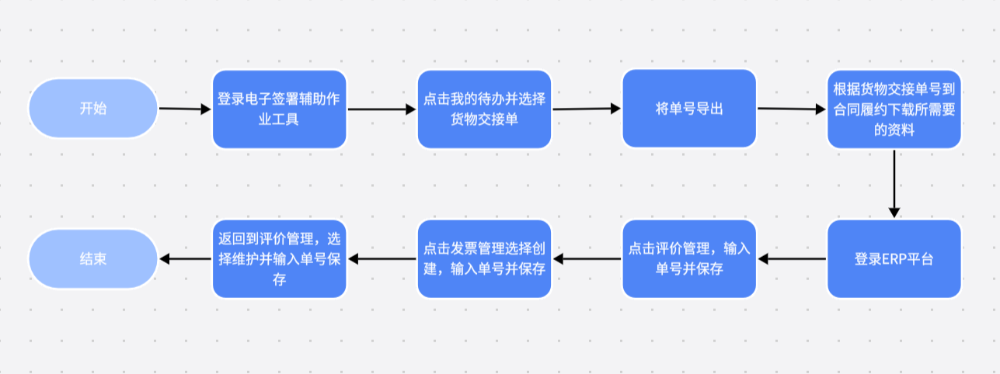

<h1 class="navbarBottom"></h1>

***

# 物资自动化单据签章RPA场景分享

## 场景介绍：

​	物资部门在处理货物交接单的相关流程时，工作人员通常需要手动登录电子签署辅助作业工具平台，并下载所需资料，这一步骤不仅效率低下，而且极大地消耗了人力资源。相比之下，对于登录ERP系统进行评价管理和发票管理的任务，则更适合采用自动化手段，例如通过部署机器人来执行，这样可以显著减轻工作人员的负担，提升整体作业效率。

## 场景流程：

 

## 应用成效：

​	1.流程自动化与效率提升：RPA技术能够自动化处理诸如登录电子签署辅助作业工具平台、下载货物交接单所需资料、登录ERP系统进行评价管理和发票管理等重复且繁琐的业务流程。通过自动化这些流程，企业能够显著减少人工操作的时间，提升工作效率，从而更快地响应客户需求，缩短业务处理周期。

​	2.减少错误与提高准确性：人工操作往往容易出错，尤其是在处理大量数据时。RPA技术通过精确模拟人工操作，能够减少因人为因素导致的错误，提高业务处理的准确性。例如，在下载货物交接单所需资料时，RPA可以确保所有必需的文件都被正确下载，避免了遗漏或错误下载的情况。

​	3.资源优化与成本节约：RPA的应用能够释放人力资源，使工作人员从重复性的工作中解脱出来，专注于更具价值的任务。这不仅提升了员工满意度和工作效率，还降低了企业的人力成本。同时，RPA还能够优化业务流程，减少不必要的环节，进一步降低成本。

## 联系我们：

如需要RPA技术支持、详细场景介绍以及RPA项目相关，请联系我们：焦工 13191142883

 

