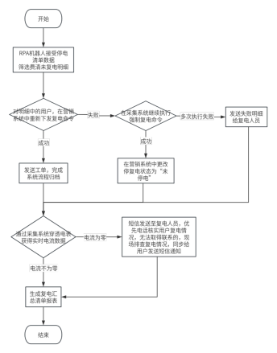
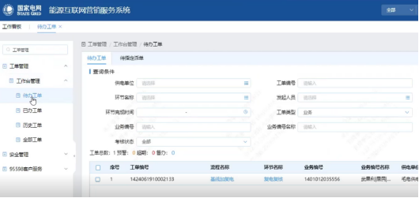
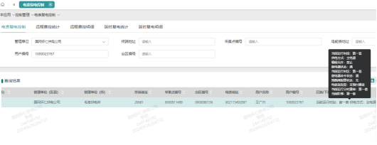
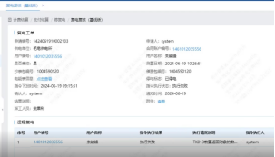
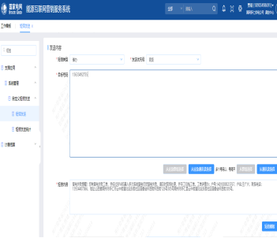
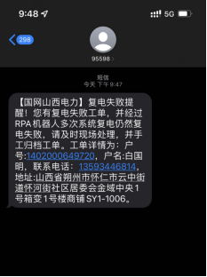
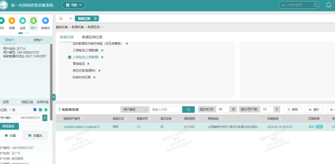
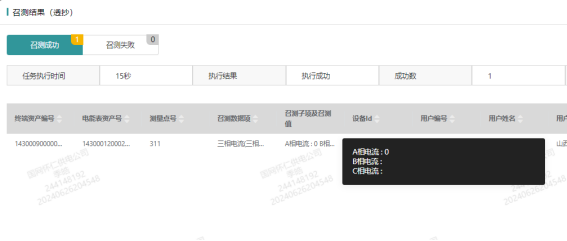
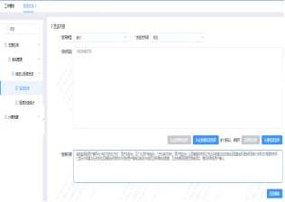

<h1 class="navbarBottom"></h1>

***

# 费控复电场景使用指导手册
## 场景介绍

传统的费控复电业务为在欠费停电用户在通过多渠道进行缴费后，会在营销2.0系统中先自动执行复电命令下发，朔州市区每个个供电所分别需要1名复电值班员值守，定时手动筛选在途工单、不停刷新实时监测，或通过三级服务调度派单的方式，优先对需要复电的用户进行系统远程复电并手动归档工单，部分系统无法复电的需要进行现场复电工作。

目前存在的问题：

①环节多，流程复杂，容易发生故障对用户电表停复电状态感知错误；

②系统显示和现场显示停电状态不一致，显示“假复电”；

③人工手动执行，效率低下，非工作时间复电失败无法及时响应；

机器人将24h根据设定的时间自动执行，实时监测复电复核工单并二次复电，系统归档，整个流程如果出现异常工单会自动短信提醒台区经理。复电后将进一步透抄用户电表，将电表的系统状态和现场状态进行匹配，不一致进行短信提醒用户确认。

## 场景流程

1.获取代办工单

①RPA机器人在设定时间自动登录营销系统

②自动打开代办工单菜单筛选复电复核工单

2.费控复电，复电成功记录结果并进行归档操作

①RPA机器人逐个工单进行二次复电

②复电成功后归档营销系统的基线加复电工单

 

3.系统复电失败短信提醒

①复电多次失败切换账号打开自定义发送短信菜单

②将现场需复电用户的详细信息发送至复电工作人员

 

4.系统电流检测异常短信提醒

①对复电工单进行电流数据透抄

②判断电流数值，不为零证明复电成功

③电流为零，则无法准确判断现场表计是否合闸成功

④短信发送至用户以及工作人员进行现场确认

  

## 应用效果

7*24h实时监控复电：在有自动机器人的支撑下，每个供电所无需安排人员进行实时监控，掌握复电工单处理情况，便可轻松解决欠费复电申请工单处理量大、时间长、效率低等突出问题。由于是全天候自动接单、精准传递及自动回单，该自动化工具能够将欠费复电工单处理时长由原来的最多三个小时分钟压减至45分钟以内，同时处理平均时长也大幅压缩,从原来的1.5小时以上下降至目前的30分钟内,成功处置率平均达95%以上。

短信提醒，及时响应：因多系统命令下发与指令回传，环节多，流程复杂、表计现场环境较为复杂、计量设备品规不同、系统终端信道稳定性等不可控因素，智能复电自动化处置小工具在实际应用中无法100%实现准确复电，可能会出现用户现场复电情况与系统不符的情况。所以需要给对应的台区负责人自动发送短信，通知其进行人工处理。基层员工可根据复电服务要求，设置复电工单监控的频率间隔，可从每2分钟一次至每1小时一次。

规避“假复电”：为避免自动化处置小工具出现误判，在远程复电成功后，还会通过用采系统，分析终端里用户的实时电流值，若透抄电流成功，则复电工单归档，若透抄电流失败或者为0，将延迟5分钟再透超一次，2次透抄均失败或为0则发短信通知台区经理，进行现场处理。

## 联系我们

如系统更新，场景涉及点击动作执行失败或者其他问题也可以直接拨打技术人员电话：13623459061或者下方微信联系我们，之后安排技术人员进行维护。

