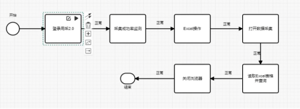
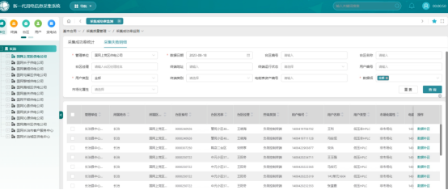
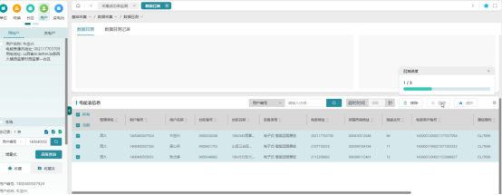

<h1 class="navbarBottom"></h1>

***
<!-- 数据补招 -->
# 数据补招

## 场景介绍

供电所人员每天需要通过采集2.0系统对采集失败用户进行数据补招，但由于采集失败用户量大且为保证补招成功率需要逐户进行操作，
工作人员每天需要耗费2-3小时进行补招操作，如遇到极端天气情况采集失败用户数急剧增多，人工采集时长更高，针对此项重复操作且耗时的业务流程迫切需要通过自动化流程机器人代替人工执行。

### 场景流程

我们主要做法是通过RPA自动化流程机器人，实现自动导出数据补招失败用户，并对失败用户实现自动补招业务操作，业务流程即：
自动登录采集2.0系统，在采集成功率检测中导出区县单位采集失败明细，通过Excel表格操作，筛选出以供电所为单位或以营业厅为单位的失败表计及用户，
在数据召测中自动对失败表计或终端进行数据补招，为保证补招成功率采取自动多次补招策略，最后把无法召测回的数据写入Excel表格，发送至后台管理人员进行处理。

### 应用成效

图1 自动查询失败用户

图2 对失败用户进行自动补招

图3 查看自动补招进度

任务频率：每天执行
应用成效：

1、设定非工作时间定时自动执行，工作时间不占用电脑，释放员工工作时间，提升工作效率；

2、一键执行，自动导出采集失败用户并根据失败数据自动进行补招操作，无需人工干预，大大降低了人工出错率；

3、采取多次重复自动补招策略，提升补招成功率，提升部门考核指标。

已在长治城区进行了安装部署，在长治市公司进行演示，反馈良好，针对发现问题我们会持续进行优化。

图1 现场使用情况

图2 现场使用情况

图3使用反馈情况

## 联系我们：

​	如需要RPA技术支持、详细场景介绍以及RPA项目相关，请联系我们：焦工 13191142883
