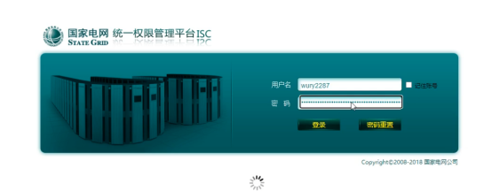
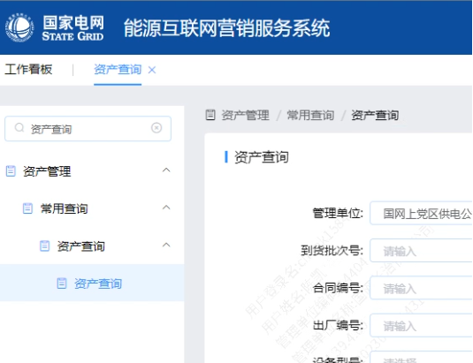
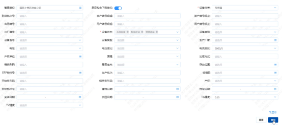
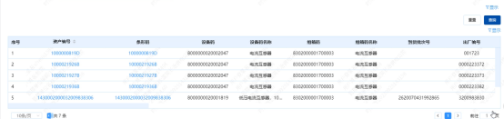
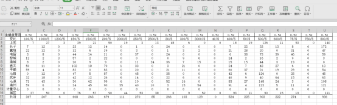
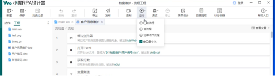
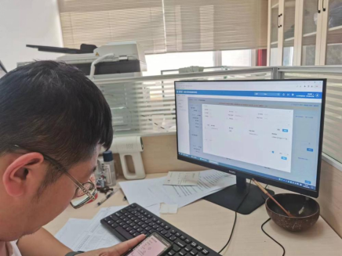

<h1 class="navbarBottom"></h1>

***

<!-- 资产管理 -->
# 资产管理自动统计场景

## 场景介绍

供电公司人员每天需要通过营销2.0系统按单位层级、资产类型、资产状态、库房类型等多维度统计资产在库情况，完成对全部资产的精准分析，帮助资产有序流转与相互调配，工作人员每天需要耗费4-5小时进行资产统计的操作，针对此项重复操作且耗时的业务流程迫切需要通过自动化流程机器人代替人工执行。

### 场景流程

我们主要做法是通过RPA自动化流程机器人，实现自动登录营销2.0-->资产统计-->选择单位-->选择资产类型-->选择资产状态-->选择库房类型-->点击查询-->复制下发总条数数字，对所有按照单位层级、资产类型、资产状态、库房类型等多维度统计资产在库情况数据填写至Excel表格，并对统计数据进行计算总和，占比分析，最后把此统计完成的表格发送至专工邮箱。

执行步骤：实现自动登录营销2.0

-->资产统计-->

选择单位-->选择资产类型-->选择资产状态-->选择库房类型-->

点击查询-->复制下发总条数数字，

对所有按照单位层级、资产类型、资产状态、库房类型等多维度统计资产在库情况数据填写至Excel表格，并对统计数据进行计算总和，占比分析，

最后把此统计完成的表格发送至专工邮箱

登录账号，密码文件存放路径：D:\xiaowo-work\ \资产管理\账号密码.xlsx

最后的统计表文件存放路径：D:\xiaowo-work\ \资产管理\统计表.xlsx

RPA使用，导入程序后，点击运行，即可使用。

## 应用成效

任务频率：每天执行

应用成效：

1、设定非工作时间定时内执行，工作时间不占用电脑，释放员工工作时间，提升工作效率；

2、一键执行，自动导出各种不同电流，电压合格在库，配送在途，运行的电能表，互感器，专变信息，自动发送，自动审核，无需人工干预，大大降低了人工出错率；

3、提高了机器利用率，提升部门考核指标。

已在长治城区中心进行了安装部署，在长治市公司进行演示，反馈良好，针对发现问题我们会持续进行优化。

图1 现场使用情况

图2 现场使用情况

## 联系我们：

如需要RPA技术支持、详细场景介绍以及RPA项目相关，请联系我们：焦工 13191142883

