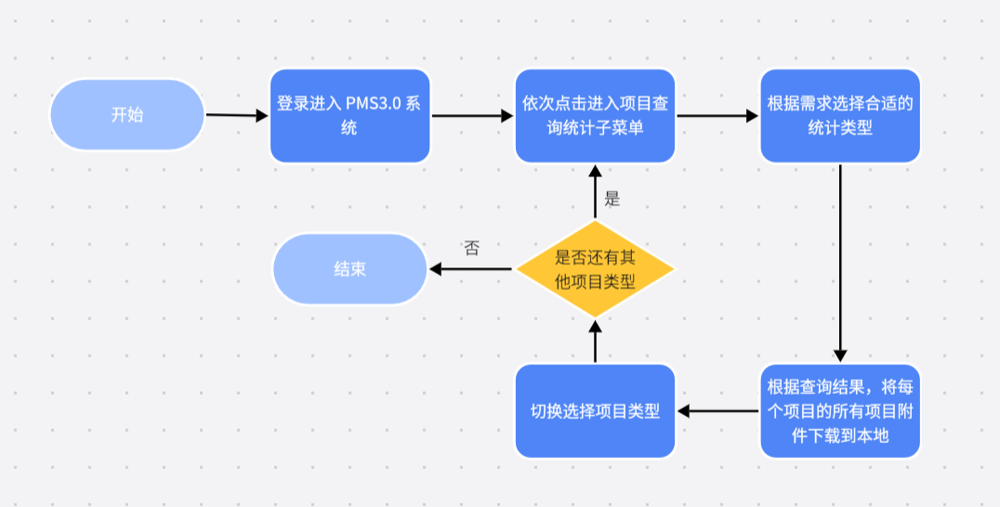

<h1 class="navbarBottom"></h1>

***

# PMS3.0附件自动下载RPA场景分享

## 场景介绍：

​	在当前的业务环境中，工作人员需要频繁登录pms3.0系统以获取技改项目和大修项目的相关信息。这一流程涉及多个层级的菜单导航和参数配置。在PMS系统上，他们需要根据实际需求配置统计类型和计划年度，然后点击查询按钮以检索相关项目。对于检索到的每一个项目，工作人员都需要手动进行附件的下载操作。

​	然而，这一流程存在一个显著的业务痛点，对于数量庞大的项目而言，每次进行附件下载操作都需要人工逐个点击菜单、配置参数并执行下载，这一过程极为繁琐且耗时。这不仅极大地消耗了人力资源，还显著降低了工作效率。因此，亟需一种自动化的解决方案来优化这一流程，减轻工作人员的负担，并提高整体业务处理的效率。

## 场景流程：

 

## 应用成效：

​	1、设定非工作时间定时自动执行，工作时间不占用电脑，释放员工工作时间，提升工作效率；

​	2、一键执行，自动导出采集失败用户并根据失败数据自动进行补招操作，无需人工干预，大大降低了人工出错率；

​	3、采取多次重复自动补招策略，提升补招成功率，提升部门考核指标。

## 联系我们：

​	如需要RPA技术支持、详细场景介绍以及RPA项目相关，请联系我们：

