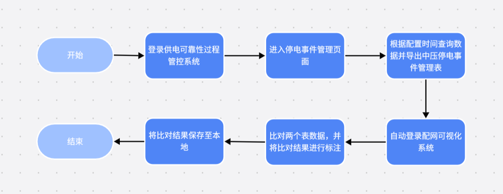

<h1 class="navbarBottom"></h1>

***

# 配网可视化数据自动比对RPA场景分享

## 场景介绍：

​	在现代电力系统的复杂运维环境中，供电可靠性与服务质量的提升成为了电力企业关注的重点。为了实现对供电过程的精细化管理，企业部署了多个专业系统来支持日常运营。其中，供电可靠性过程管控系统与配网可视化系统是两个至关重要的组成部分。

​	自动比对整个流程不仅耗时费力，而且容易出错。由于涉及到多个系统的切换和数据的手工比对，工作人员的工作负担较重，且难以保证数据的准确性和完整性。因此，企业急需RPA自动化技术来优化这一业务流程，提升供电可靠性管理的效率和准确性。

## 场景流程：

 

## 应用成效：

​	1.流程自动化与效率提升：RPA机器人能够自动登录供电可靠性过程管控系统，执行停电事件管理查询，导出中压停电事件管理表；随后自动切换至配网可视化系统，执行停电信息发布查询，导出停送电信息表。这一过程无需人工干预，极大地缩短了操作时间，提升了工作效率。

​	2.数据比对与准确性增强：RPA机器人能够自动比对两份表格中的数据，精准识别出相同的数据项，并在停电信息表中高亮显示。这一过程避免了人工比对可能带来的错误和遗漏，提高了数据的准确性和可靠性。

​	3.资源优化与成本节约：RPA技术的应用释放了工作人员从繁琐的数据查询、导出和比对工作中，使他们能够专注于更具价值的分析和决策工作。这不仅优化了人力资源配置，还降低了运营成本。

## 联系我们：

​	如需要RPA技术支持、详细场景介绍以及RPA项目相关，请联系我们：

