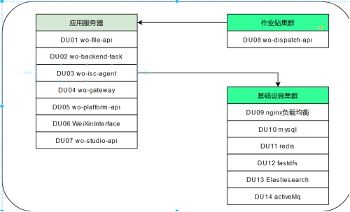
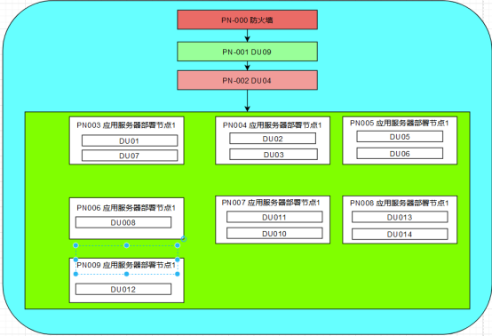
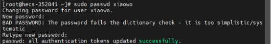

# 第二章：运行环境

## 2.1 部署规划

### 2.1.1 部署单元设计 

RPA平台部署单元包含wo-file-api、wo-backend-tas、wo-isc-agent isc、wo-gateway 网关服务、wo-platform-api 平台服务、WeiXinInterface 小程序服务、wo-studio-api 设计器服务、wo-dispatch-api 机器人调度服务

wo-file-api： 文件服务，用来统一处理文件上传下载功能。
wo-backend-task：定时任务服务，用来做后台定时任务执行，如用户解锁。
wo-isc-agent isc登录代理服务、wo-gateway 网关服务、wo-platform-api 平台服务、WeiXinInterface 小程序服务、wo-studio-api 设计器服务、wo-dispatch-api 机器人调度服务

### 2.1.2 部署节点设计

推荐部署节点设计

最小化部署节点设计

RPA平台关键单元都采用集群模式部署，防止因单一节点故障引起系统宕机风险。业务节点可以根据具体业务量的大小来确定是否采用集群模式；作业站节点将根据用户需要处理的自动化任务多寡而定

### 2.1.3 目录和用户规划

为保证系统和稳定的一致性，部署RPA平台时，需要在操作系统中建立一个名为xiaowo的用户，并且用户组也是xiaowo；同时需要在xiaowo的home目录下建立一个名为apps的目录，在后续部署系统过程中部署单元1到8和15都应该部署在这个目录下。
关于基础设置集群，如果用于存储数据的基础中间件，都应该在根目录下新建一个/data目录，用于存储对应的数据。

在apps目录下需要创建各个服务的工作目录（目录名参照第四章内容创建），并在对应的工作目录下需默认创建4个目录。
conf（用于存放配置文件）
logs（用于存放日志文件）
services（用于存放程序包）
bin（用于存放启动脚本）

#### 2.1.3.1 配置虚拟大小

如果PN008服务器部署了ElasticSearch，需要修改虚拟内存使用限制，以root权限登录服务器，执行以下命令：
 
$ sudo sysctl -w vm.max_map_count=262144
$  echo "vm.max_map_count=262144" | sudo tee -a /etc/sysctl.conf

#### 2.1.3.2 添加用户组

1、查看是否存在xiaowo用户
cat /etc/passwd | grep xiaowo

表示文件不存在

2、添加用户组
groupadd xiaowo

3、新建用户
useradd -g xiaowo xiaowo

4、设置用户密码
sudo passwd xiaowo

### 2.1.3.3 创建部署目录

1、切换到xiaoxo用户
su - xiaowo

2、创建目录
mkdir apps

3、获取应用部署目录的绝对路径
cd apps
pwd

记录：/home/xiaowo/apps

后续部署节点的所有应用包的部署目录，都在这个目录下进行。
